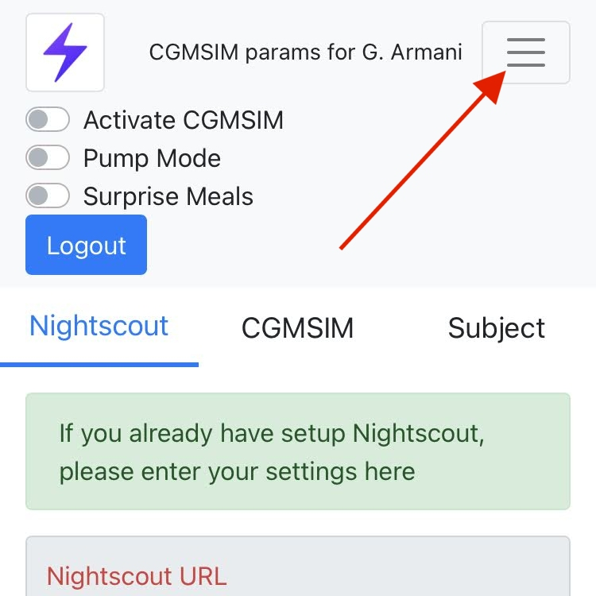

# Activation

<u>After you have:</u>

1. Set up Nightscout
2. Set up your T1D subject, 
3. Chosen the simulator's parameters
4. Kicked off the simulation 
5. Set up email and/or push alerts

**You are ready to activate or "start" the simulation.**

On the top right corner, the ("Hamburger") menu button reveals various functionalities that we'll consider later. Just select the "Activate CGMSIM" switch, close the menu and you're done. The next CGM value should appear in Nightscout a few minutes later, and then every 5 minutes as long as CGMSIM is active.

You can deactivate/stop CGMSIM any time you want, but in order to maintain service availability for as many users as possible, <b> idle accounts will be inactivated automatically a few weeks after the last declared insulin entries, and the Nightscout instance deleted. You have been warned !</b>
  

Curious about an alternative T1D model? [See your options.](model.md)

 
