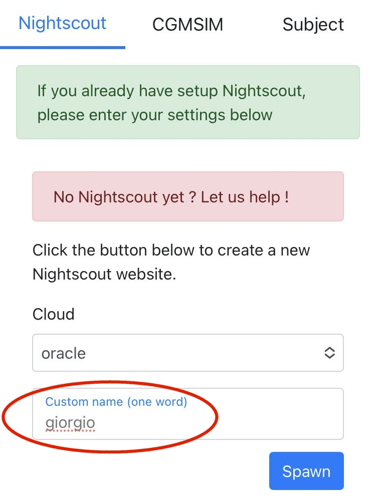
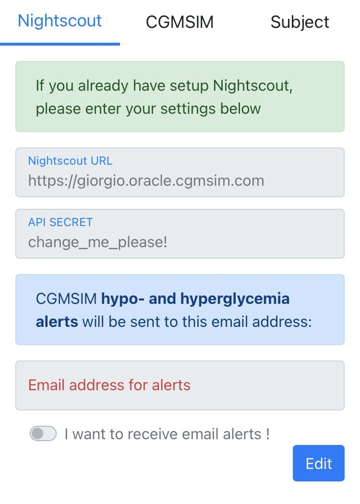
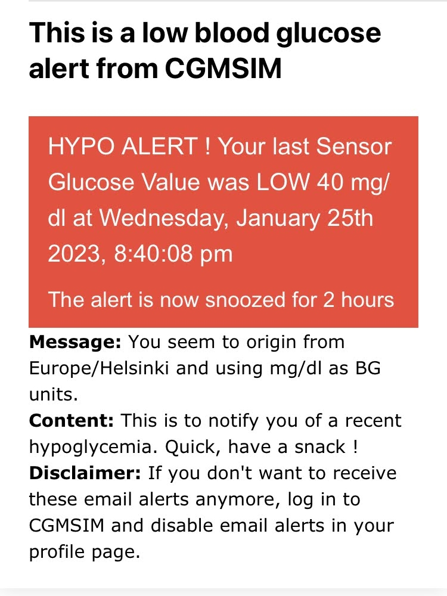

## Nightscout setup

CGMSIM needs to be coupled to a Nightscout website. Nightscout provides a graphical interface where the CGM results are displayed every 5 minutes. It also allows for declaring meals, insulin doses, physical activity, etc. <a href="https://nightscout.github.io" target="_blank">The Nightscout project's documentation can be found here.</a>

Nightscout can be set up Nightscout separately as in the documentation above, but we decided to let you deploy or "spawn" one instance automatically for personal use with CGMSIM. Beware, some plugins have been disabled in the version we provide.

If you already have setup your own Nightscout instance on Heroku or anywhere else, please just specify the full URL and the password (or "API secret") in the corresponding fields below. Scroll down, press **Edit**, fill in the details, and save. 

If you'd like to deploy or "spawn" a new Nightscout instance, here is how:

### Spawning a new Nightscout instance

To create a new Nightscout instance, select one of the available **Cloud** servers from the drop-down menu (here: "oracle"), and choose a **one-word custom name**. The click the button **"Spawn"**. 

Always prefer the server with the lowest number, eg. oracle rather than oracle2, etc...

 
After a few seconds, the new Nightscout website is ready to be used, and its details are presented in the following screen :

<u>Notice the format of the URL.</u> You can copy-paste it in your browser and visit your (empty) Nightscout website. Feel free to change the password or "API secret". However, if you change the Nightscout URL, make sure you change it to an existing Nightscout instance.

The instructions for using Nightscout are available from the <a href="https://nightscout.github.io" target="_blank">official documentation</a>, but the details more specific to CGMSIM are presented in our specific [Nightscout section](../nightscout/profile.md).

## Email Alerts
Optionally, you can select to receive email notifications for hypoglycemic and hyperglycemic events.

Next we'll go through all pages profile one by one. please follow this link: [Edit your subject's parameters](subject.md).

 
