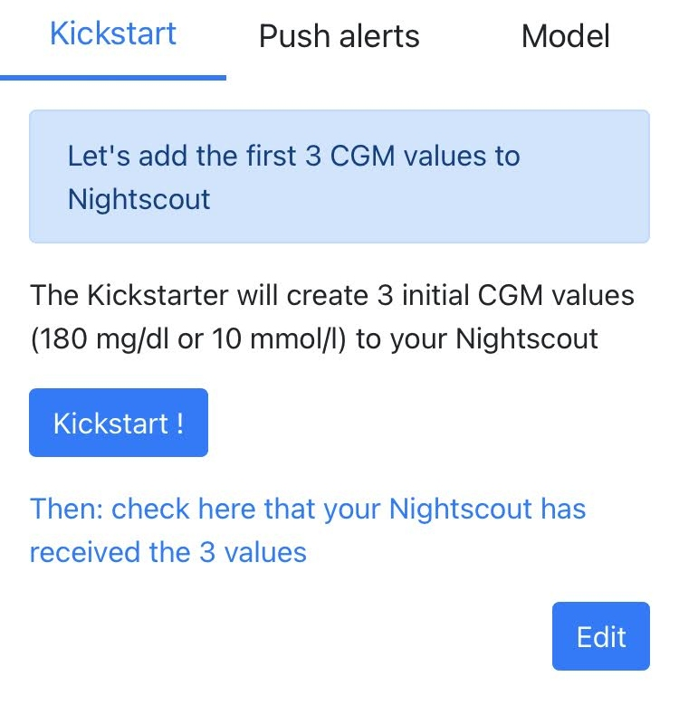

# Kickstart 

For CGMSIM to start its calculations, you'll need 3 initial sensor glucose values at least. Even without "kickstarting", the calculations will start with default values.

"Kickstarting" doesn't mean activating the simulation. It merely provides 3 CGM values. You'll still need to put the simulation in first gear or ["activate it"](activate.md) later.

CGMSIM bases its calculations on the impact of Insulin on board (IOB), Carbs on board (COB), Endogenous Glucose Production (EGP) and Physical activity (PA). 

The global inpact of these factors is a "difference" or "delta", applied on the last reported value. We use no smoothing algorithm to display our CGM values in Nightscout.

The Kickstarter can be re-used later to re-initiate the simulation.

Emails alerts aren't enough ? Next, let's set up [Push Alerts](push_alerts.md).

 
