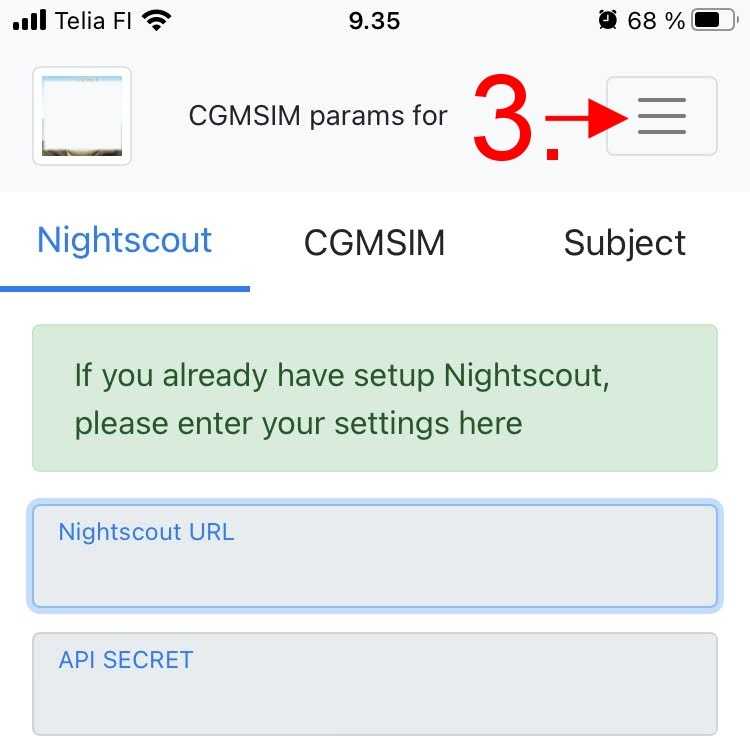

<!--  -->

Fitbit is the preferred method for creating and authenticating accounts in CGMSIM. When you sign in using your Fitbit® credentials, you give CGMSIM permission to access your physical activity data from the Fitbit Web API. <u>However, CGMSIM will only retrieve your data when you specify it separately in the Admin Panel</u>.

Although the Fitbit app on your phone uploads data to the Fitbit server every 15 minutes, we retrieve data every 5 minutes to ensure we always have the latest information.

We then format and send your data to the Nightscout webpage, where it is stored along with your CGM values and treatment entries (insulin and meals).

## 1. Sign-in using Fitbit

 

## 2. Enter your credentials

 

## 3. Open the Menu

 
## 4. Activate the switch 

You can "uncouple" your data from CGMSIM by deactivating the switch any time.
