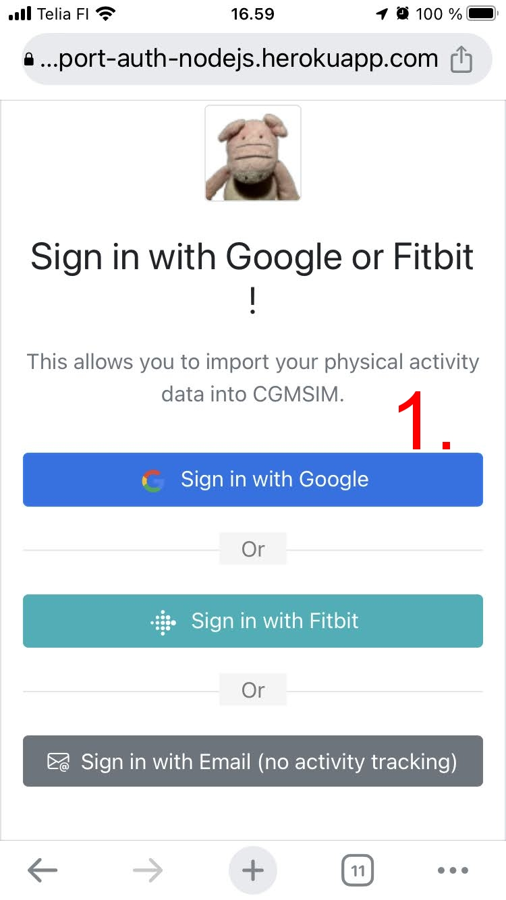
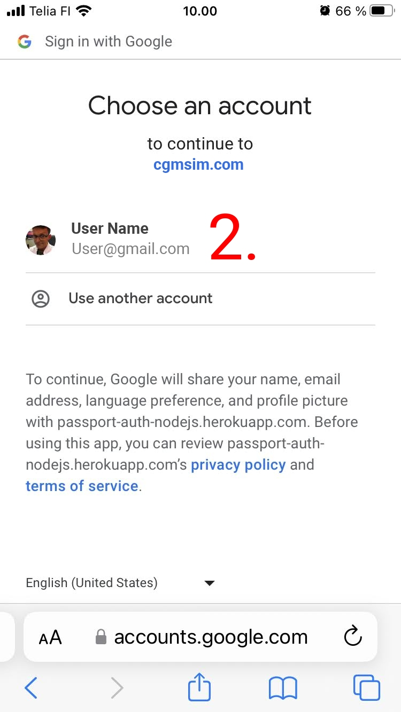
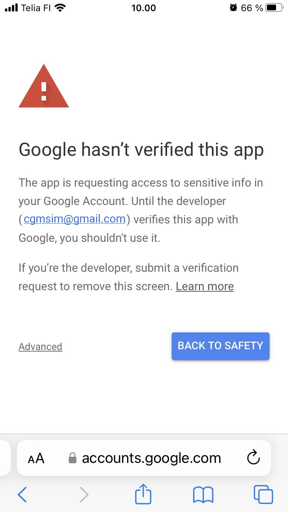
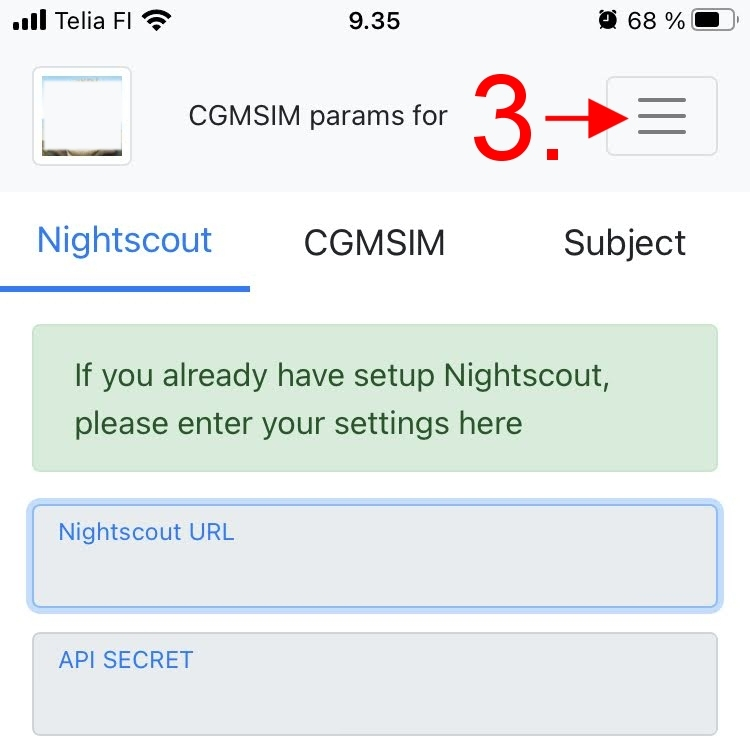
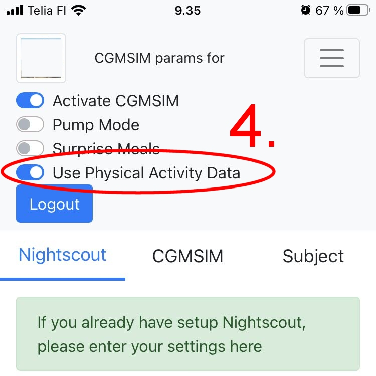

Google offers a range of cloud services, such as Gmail, Google Maps, and Google Drive, etc... Google Fit is a mobile app and a cloud service that stores records of your physical activity. Once you activate the Google Fit app on your phone, it will regularly update your physical activity data in the cloud.

## Activity Trackers
Several fitness trackers can be linked to Google Fit: Apple Watch, Wear OS watches, Polar watches, Fossil Smartwatches, Oura rings, and even Fitbit watches using the FitToFit Android app. However, if you use an iOS device, your data will only sync when your phone is unlocked, which may cause delays for example at night.

## Warning about Google validation
If you sign in to CGMSIM using your Google credentials, CGMSIM will retrieve your public profile to create your CGMSIM user profile. Google will notify you that CGMSIM will also access your physical activity data and that CGMSIM has not been verified and may be unsafe (see below).

Due to Google strict data protection policy, CGMSIM would need to undergo an external yearly security assessment to remove the warning screen. Although this process is under consideration for the future, it has not been completed yet. However, we want to reassure you that your data is only retrieved, sent formatted to Nightscout's API and not stored anywhere else.

## 1. Sign-in using Google

 
## 2. Select your Google account 

 
## 2b. Acknowledge the warning and click "Advanced"
 

 
## 3. Open the menu

 
## 4. Activate the switch 

You can "uncouple" your physical activity data from CGMSIM by deactivating the switch at any time.

