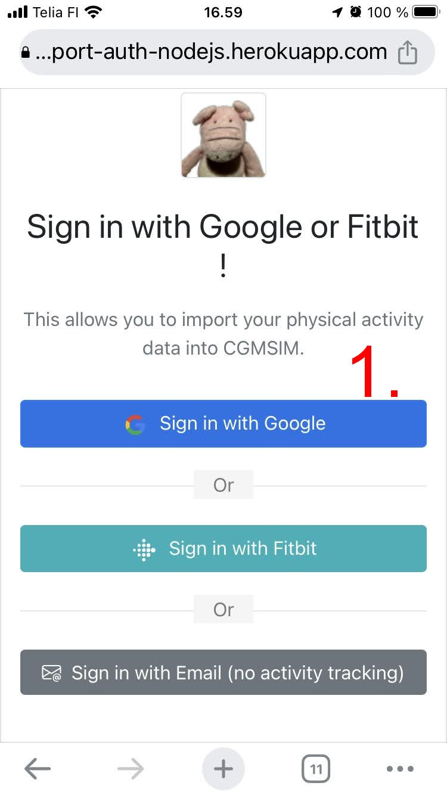
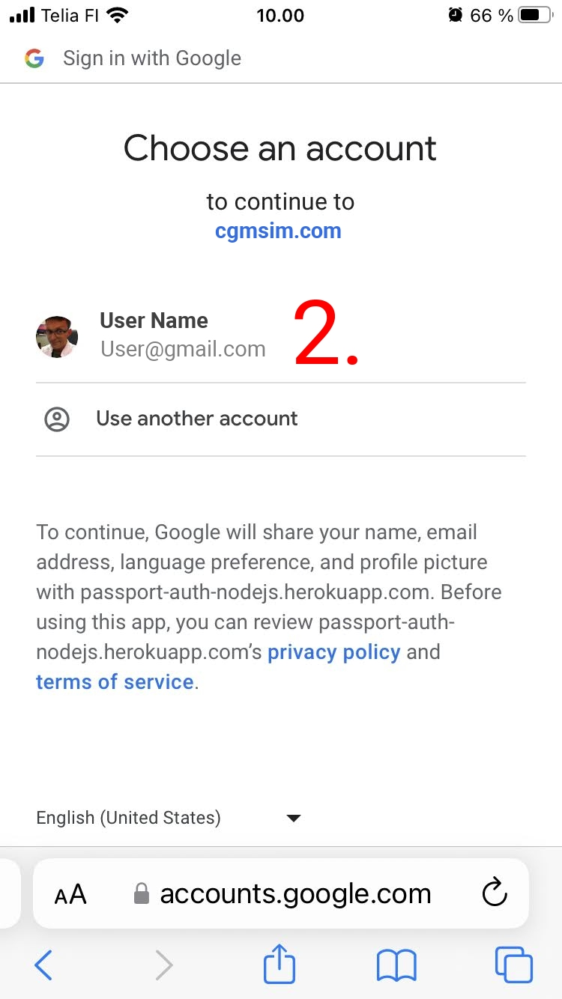
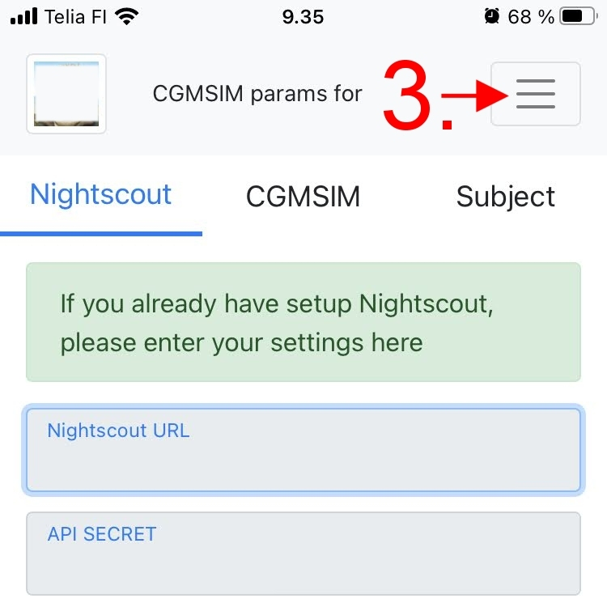

If you sign in to CGMSIM using your Google credentials, CGMSIM will retrieve your public profile to create your CGMSIM user profile.

## 1. Sign-in using Google

 
## 2. Select your Google account 

 
## 3. Open the menu

