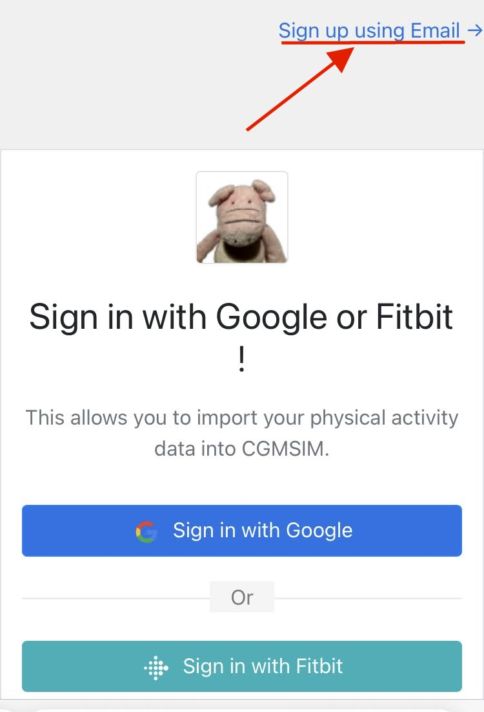
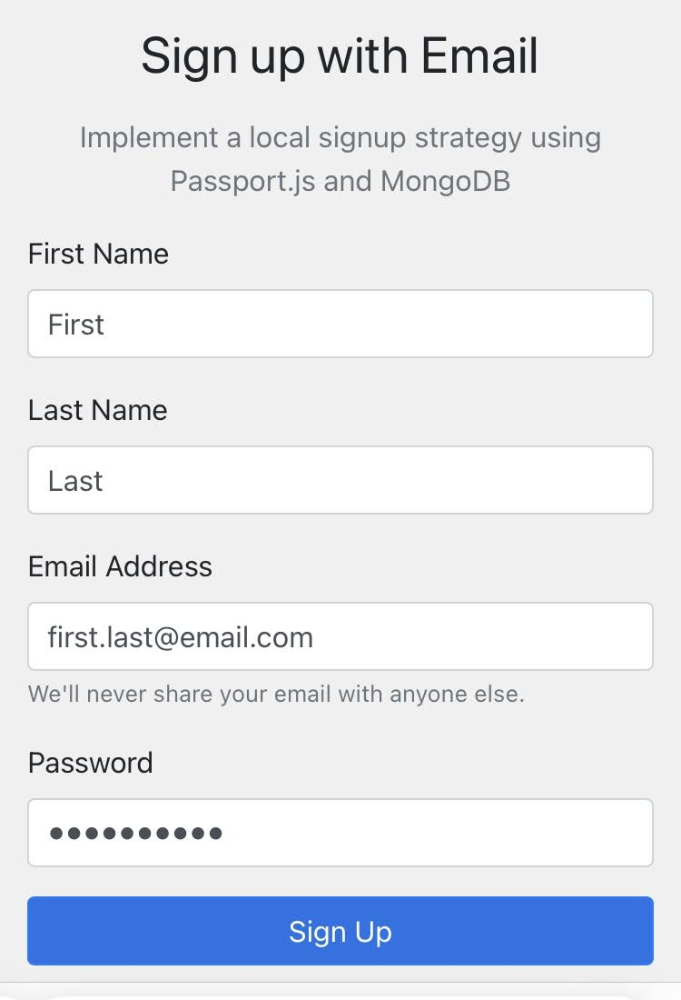
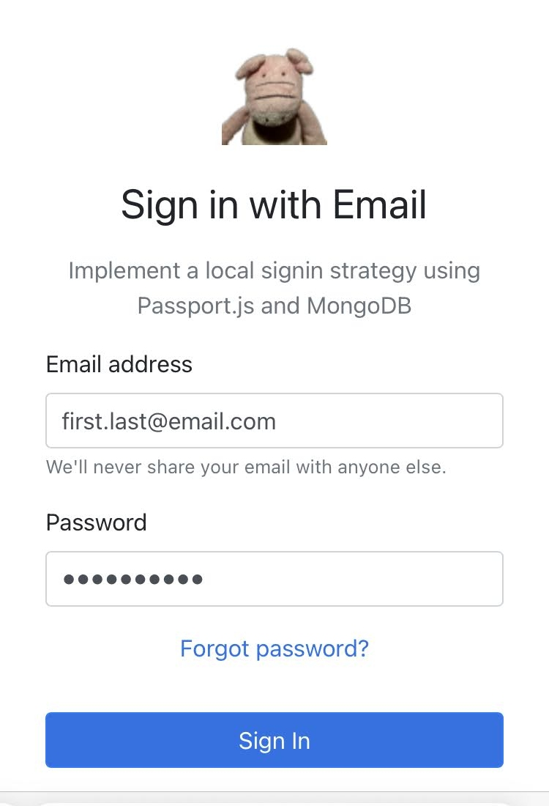

Should you prefer not to use Fitbit or Google sign-in credentials, you can create a new account by clicking the "Sign up using Email" link on the top right of the page.

Once your account is created, just sign-in using this email address and password. Be sure to use a real email address, as it can be used to retrieve forgotten passords, and to receive email alerts.

The options concerning physical activities are not available for users signed in using a local account.

## 1. Sign-up using Email

 
## 2. Create your account 

 
## 3. Sign in to your account 
