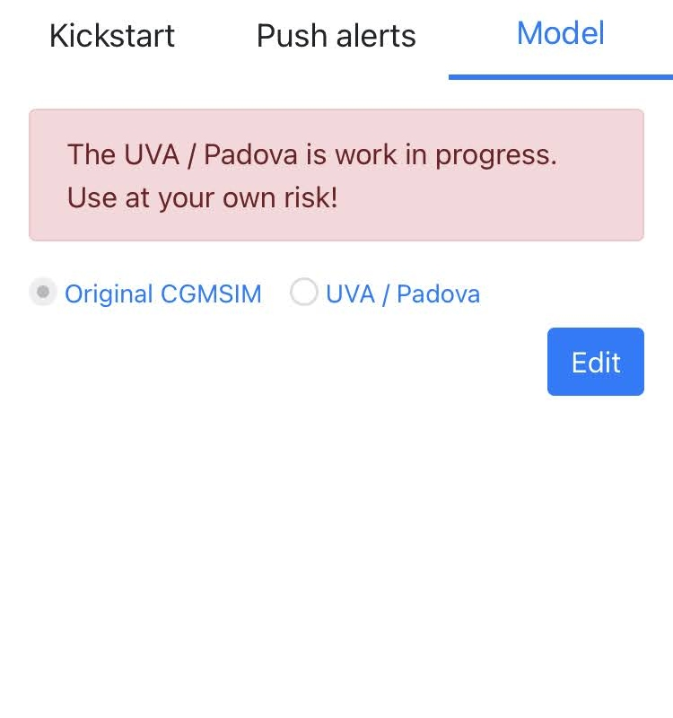

# Model
CGMSIM is written as a very simplified model of human physiology, <u>certainly not a precise or validated one. </u>

<a href="https://lt1.org/" target="_blank">A team of researchers of the University of Ulm has rewritten the mathematical formulas used in the UVA/Padova simulator</a>. We have included this modified version of the UVA/Padova physiological model (without glucagon modeling) as an alternative model.  

Be aware that this model require a lot of specific subject parameters and for now only one subject is modeled. This UVA/Padova simulation initiates in a steady state in "insulin pump mode" and ignores any long-acting insulin agonist entries or superimposed noise. It is here for testing purposes only.

We strongly suggest you chose the CGMSIM model for now, and read on about then [Pump Mode.](pump_mode.md)

 
