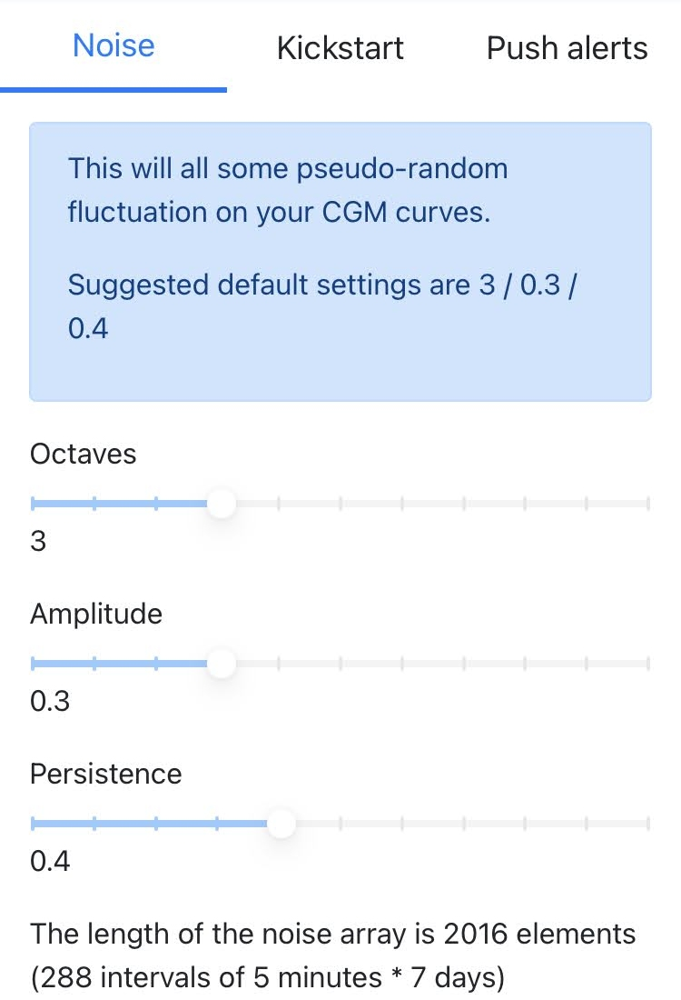

# Random Noise 
Some level of "randomness" is added to CGMSIM's calculations. It represents the fine BG variations due to physical activity, erratically absorbing insulin and carbs, emotions and counter-regulative hormones, glucose sensor imprecisions, etc... 

This is completly empiric and we suggest you keep to the suggested values. However, you are free to experiment with different values.

## Details

The pseudo-random noise here is implemented as a one-dimensional Perlin noise. <a href="https://github.com/andrewrk/node-perlin-noise" target="_blank">You can read about this algorithm here.</a>

 We're testing a much slower cyclical noise on top of the "faster" Perlin noise. This will reflect the change seasonal changes, the effect of menstrual cycle, the weight changes, etc... 

You are ready to [kickstart the simulation.](kickstart.md)

 
