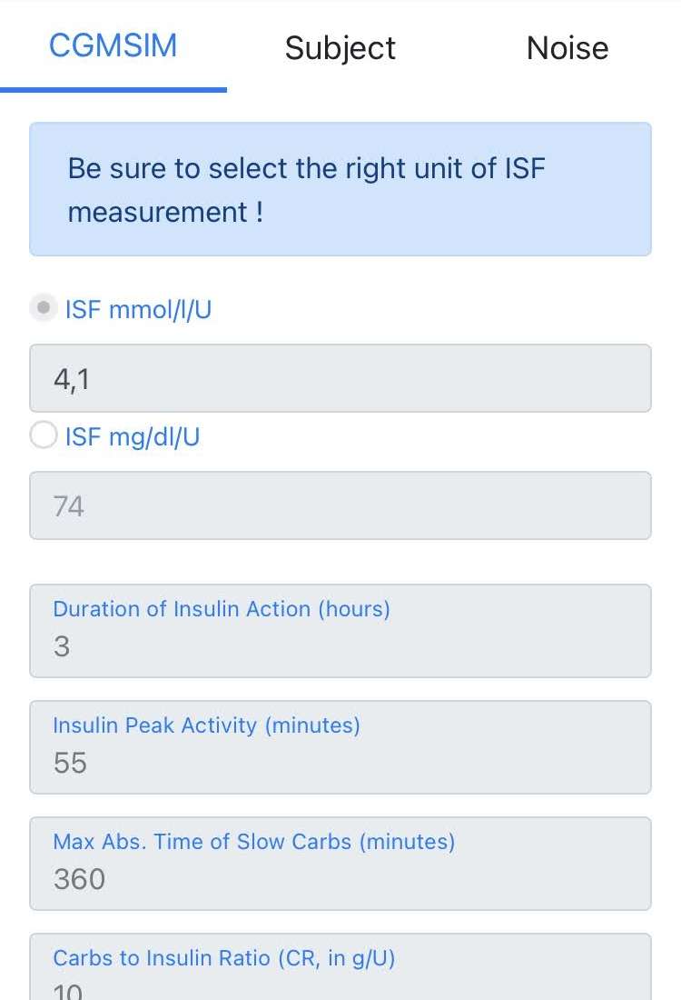

# CGMSIM parameters
Various physiological parameters can be selected here. The labels for the variables are self-explanatory. To modify the parameters, scroll down to the bottom of the page and press **Edit"**. 

## Insulin Sensitivity Factor (ISF)

The Insulin Sensitivity Factor (ISF) represents the impact of one unit of insulin on the blood glucose level (BG). Obviously one unit of insulin **decreases** the blood glucose level over its duration of activity. The higher the number, the more sensitive your virtual subject will be to insulin.

## Duration of Insulin activity (DIA) and Insulin Peak Activity

These values are related to the mealtime insulin doses. The default DIA value is 3 hours and the peak is set at 55 minutes, but feel free to experiment with different values.

## Maximal Absorption Time of Slow Carbs

In order to reflect the absorption of carbs from complex meals, each declared meal will be randomly split in fast and slow carbs. The slower carbs will be completely absorbed in the time you declare here (e.g. 360 min = 6 hours).

## Carb-to-Insulin Ratio

This represents the amount of carbs needed to counter the effect of one unit of mealtime insulin. This could be presented the other way around, but we'll follow that convention in our simulation. This is used for example by insulin pump Bolus Wizards, advising the amount of insulin to be injected in order to account for a defined amount of carbs.

Here, a CR of 10 g/U means that the user will need 1 Unit of insulin to counter the effect of 10g of carbs.

Next, let's talk about [noise, or "random variation"](noise.md).

 
