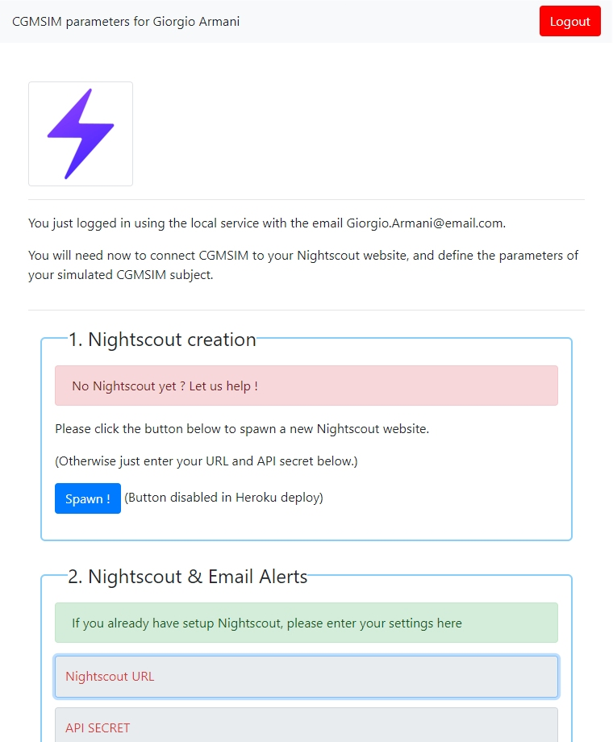

Your virtual subject has been set up, and you'll now access your personal CGMSIM Profile. The "Admin Panel" is also called the "Profile", and is displayed differently for desktop and mobile device users. However, the same functionalities are available.

Here, many parameters must be selected before the simulation can start. To make this task easier, most options have been pre-filled.

Since the desktop and mobile versions present the same options, we'll go through them in detail in the [Mobile Profile](profile-mobile.md) page.
## Desktop view

## Mobile view

Let's move on to the [Mobile Profile](profile-mobile.md) page.
 
