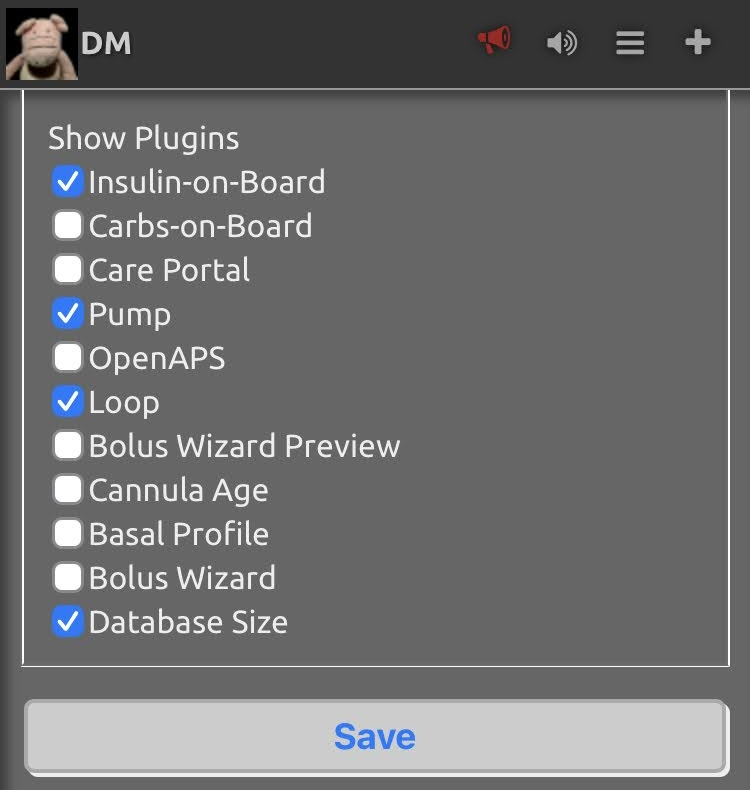

## Basal/bolus CSII

In virtual pump mode, there will be no long-acting insulin agonist. Instead, all insulin is provided as a continuous subcutaneous infusion of mealtime insulin. The basal infusion rate is set on [Nightscout's Profile Editor](../nightscout/profile.md).

This is a simple implementation of a basic basal/bolus CSII, without temporary basal rates, extended boluses, bolus wizard or other special features.

Bolusing is done by administrating mealtime insulin exactly as with Multiple Daily Injections. **There is no integrated controller or "AID" functionality** included in CGMSIM.

## DIYAPS

This is way out of the scope of CGMSIM, but there is no reason why a virtual T1D subject could not be attached to a DIYAPS system. 

If you decide to connect your virtual patient to a device running iOS Loop, FreeAPS, openAPS, or AndroidAPS, simply activate pump mode and declare the URL of your Nightscout instance in the settings of your DIYAPS device.

In Nightscout's settings, remember to activate the desired plugins (Pump + Loop/OpenAPS).

Read here about [setting the basal insulin infusion rates with Nightscout's Profile Editor](../nightscout/profile.md).

 
