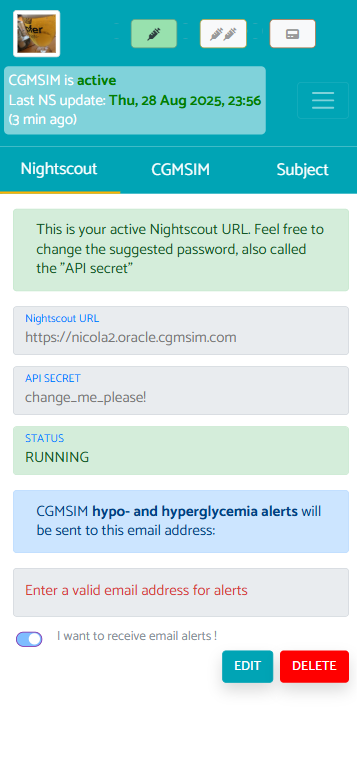

## Switch Modes

You can change mode at any time to adapt the simulator to your needs and experience level.

---

## Beginner Mode

[Beginner Mode](../app/beginner.md) simulates therapy with **multiple daily injections** and is designed to offer the simplest and most accessible way to interact with the simulator. It is ideal for those who are new to diabetes management or prefer a straightforward approach. Users can manually enter the amount of carbohydrates consumed and administer both rapid-acting and long-acting (basal) insulin. The interface is intentionally kept simple, showing only the essential options.

---

## Intermediate Mode

[Intermediate Mode](../app/intermediate.md) also simulates therapy with **multiple daily injections** and builds upon Beginner mode. It introduces advanced features such as setting a personal insulin-to-carbohydrate ratio (CR) for automatic meal bolus calculation, logging cortisone administration, and recording alcohol intake. This mode is suitable for users who want more flexibility and precision in their therapy management.

---

## Advanced Mode

[Advanced Mode](../app/advanced.md) simulates the use of an **insulin pump**, providing the most comprehensive and customizable diabetes management experience. It is designed for experienced users who require full control over their therapy. Advanced mode allows configuration of detailed basal profiles, temporary basal rates, and all features from Beginner and Intermediate modes.
