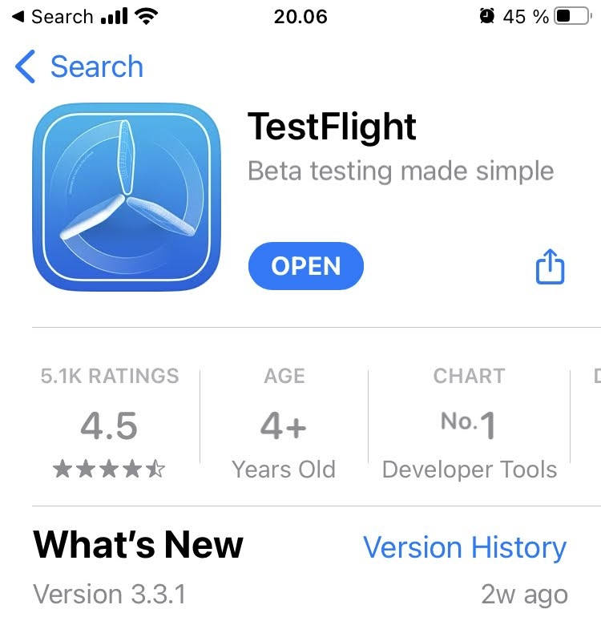
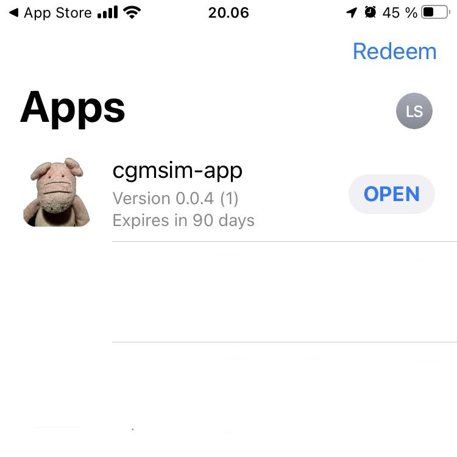
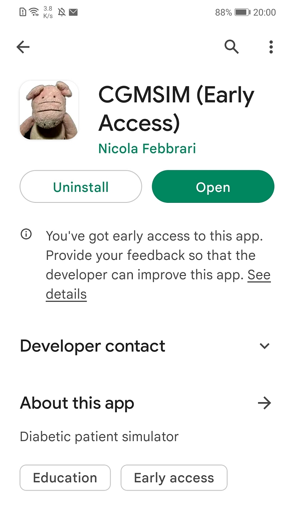
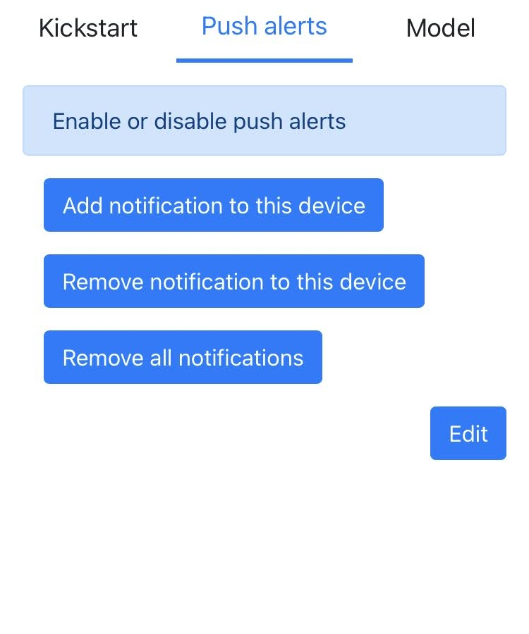
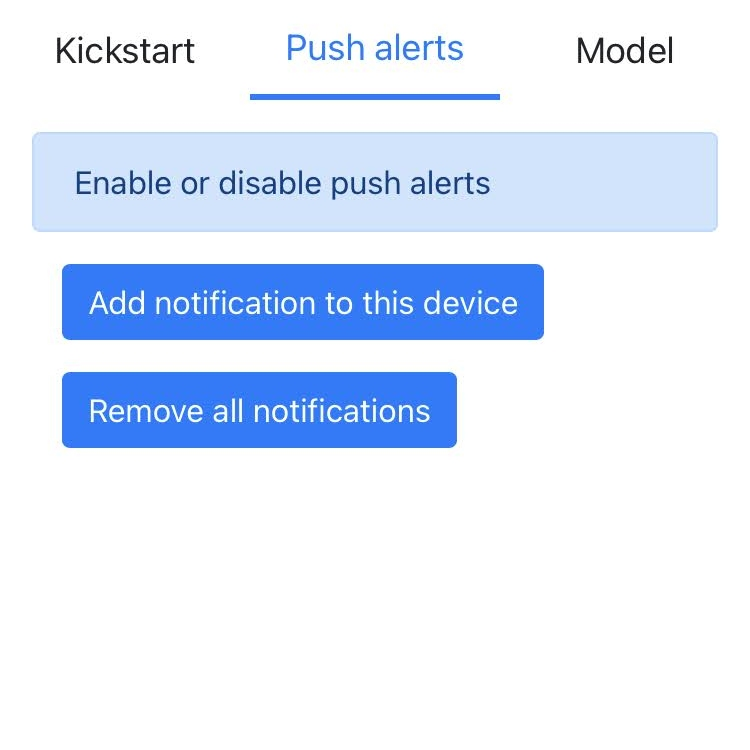
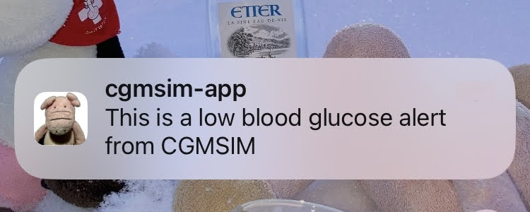
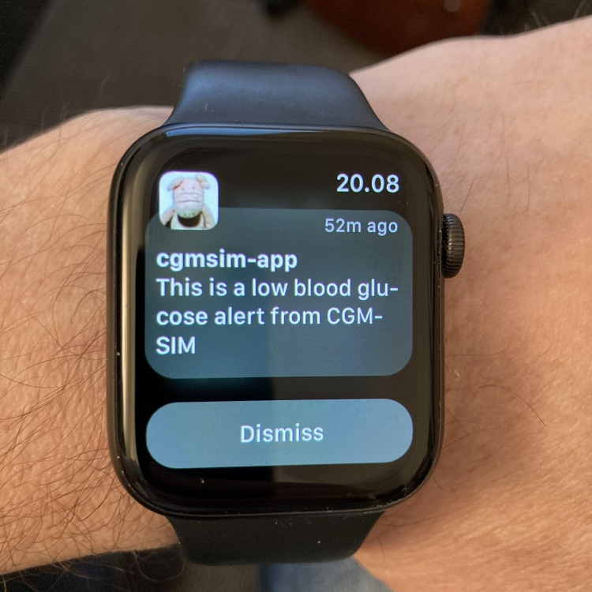

# Push Alerts

Push alerts require the use of our **CGMSIM mobile app**. They are device specific, and can only be activated when logged in with a handheld Android / iOS cell phone or tablet !
## Apple iOS and watchOS

The **CGMSIM mobile app for iOS** requires Testflight to be installed on your iPhone. 

Testflight is Apple's official app for distributing iOS applications for testing purposes. Download and install it from the AppStore.

With Testflight installed, [request an invitation from one of the developers here !](../contact/contact.md) 

When requesting an invitation, <u>indicate the email address used as your Apple ID.</u> Once your request is accepted, <b>cgmsim-app</b> will be visible in Testflight and valid for 90 days. 

You'll be prompted to install, update or open your app. Notice the expiration date ! A new version will be deployed every 90 days and you'll be prompted update your app. 

A maximum number of 100 users is allowed when distributing our application with Testflight, so be patient. We'll try to increase this number if the amount of requests requires it.

## Android

The Android version of the CGMSIM-app available in the PlayStore. It is distributed as an "Early Access release". You'll need to send a request by email by opening the Developer Contact drop-down menu.

## Enable Push Alerts

The CGMSIM mobile app works as a portal to the Admin panel. Sign in to the Admin panel, and navigate to Push Alerts page.

Press "Add notifications to this device" to receive push notifications. This feature is device-specific, anc it can be disabled any time. 

 With the last update, it should like this :  

This is a typical push alert :

You're all set ! Now let's [activate the simulation](activate.md).

 