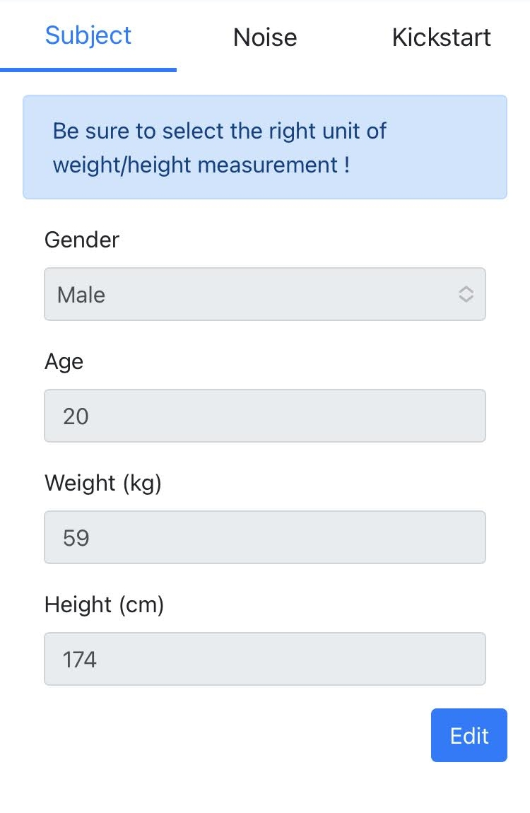

# CGMSIM Subject 
Your T1D subject was defined the first time you logged in. If necessary, you can edit your preferences here. We suggest you use your own body measurements, but you can customize your virtual subject to your liking.

Age is only used to compute a theoretical maximal heart rate. It will be used to calculate the impact of your physical activity on blood glucose. It has no other effect in this simulation.

Next, let's define some more simulation parameters: [CGMSIM's parameters](parameters.md).

 
