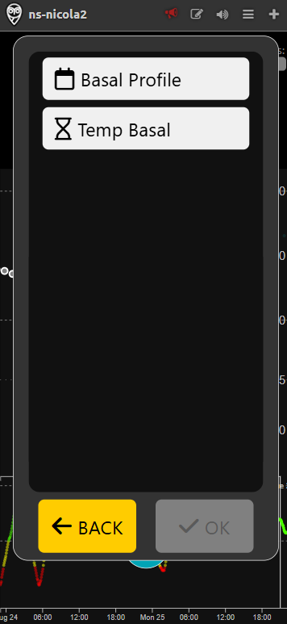
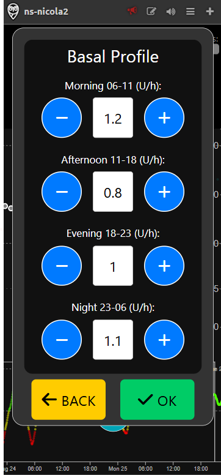
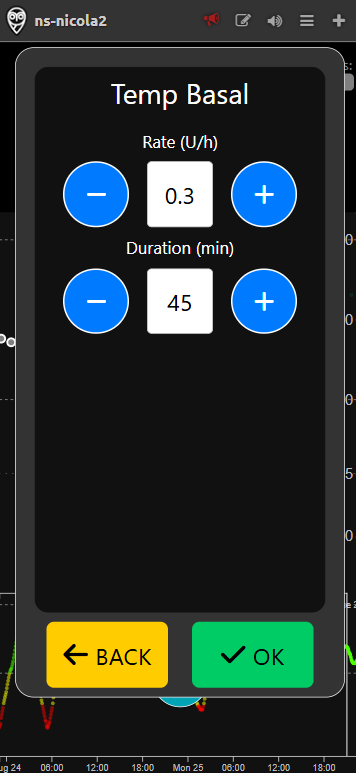

# Advanced mode

Advanced mode simulates the use of an **insulin pump**, providing users with the most comprehensive and customizable diabetes management experience available in the app. This mode is specifically designed for experienced users who require full control over their therapy and wish to take advantage of advanced features. Because Advanced mode replicates the continuous insulin delivery of a real pump, it requires the definition of detailed **basal profiles**, allowing users to set different basal rates throughout the day to match their individual needs and daily routines.

It builds on all the functionalities of [**Beginner**](beginner.md) and [**Intermediate**](intermediate.md) modes, and introduces a range of advanced options that offer maximum flexibility and precision.

## Insulin Pump Support

Within Advanced mode, users can manage all aspects of their insulin pump, including configuring basal rates, delivering boluses, and suspending pump activity when necessary. This level of control closely mirrors the experience of using a real insulin pump, making the simulation both realistic and practical for training or therapy planning.

## Basal Profile Management

The ability to configure detailed basal insulin profiles is a core feature of Advanced mode. Users can define multiple basal rates for different times of the day, ensuring that insulin delivery is closely aligned with their physiological needs. This is particularly beneficial for those who experience varying insulin requirements due to activity, meals, or other factors.

## Temporary Basal Insulin

Advanced mode also allows the use of the **temporary basal** (temp basal) feature, which lets users temporarily adjust the basal insulin delivery rate for a defined period. This option is especially useful during physical activity, illness, or other situations that require a temporary change in insulin needs.

All features from [**Beginner**](beginner.md) and [**Intermediate**](intermediate.md) modes remain available in Advanced mode, ensuring that users have access to the full spectrum of diabetes management tools as their experience and requirements grow.
