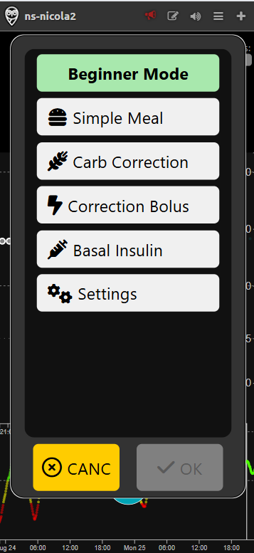
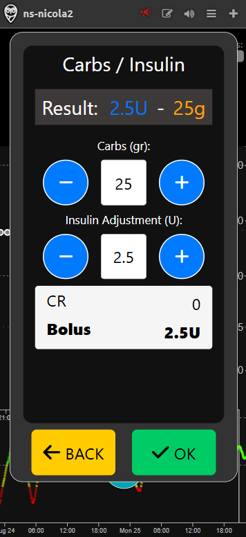
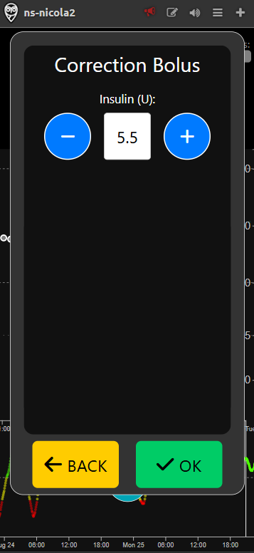
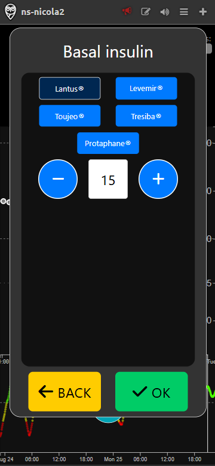

# Beginner mode

Beginner mode is the simplest way to interact with the simulator. It allows users to administer rapid-acting insulin, long-acting (basal) insulin, and to enter the amount of carbohydrates consumed during a meal or snack.

## Meal entry

In Beginner mode, you can manually enter carbohydrates and insulin in a simple way, by specifying the amount of grams of carbohydrates and units (U) of insulin. No advanced options are shown.

## Carb Correction

With the "Carb Correction" menu, you can enter the amount of carbohydrates to treat a low blood glucose (hypoglycemia).

## Correction Bolus

With the "Correction Bolus" menu, you can enter an insulin dose to correct a high blood glucose (hyperglycemia).

## Basal Insulin

The Basal Insulin interface allows you to log the administration of a long-acting (basal) insulin. You can choose the insulin type (Lantus, Levemir, Toujeo, Tresiba) and indicate how many units should be administered.

