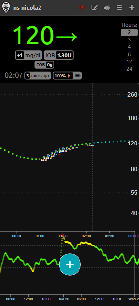
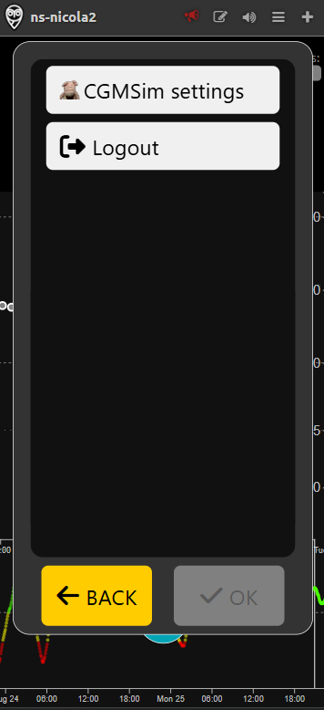

# Using the App

This page provides a detailed guide to using Careportal within the app, helping you navigate the main features and settings to interact with the patient simulator.

## Opening the Webapp

After logging in through your web browser, the webapp loads automatically, giving you instant access to the Nightscout view. If you need to return to the CgmSim configuration, simply open the settings menu and select "CgmSim Settings". This way, you can always adjust your simulator settings as needed.

## Installing the Mobile App

The app is also available for mobile devices, making diabetes management easy wherever you are. You can install it from the Google Play Store or Apple App Store. For your convenience, click the images below to go directly to the app’s page in the respective store.

## Using Careportal

To interact with the patient simulator, use the Careportal by pressing the "+" button in the center of the page. This opens an interface where you can log treatments, meals, insulin doses, and more—all in one place for easy tracking and review. Careportal makes it simple to manage and record your activities with the simulator.

## Opening CGMSim Settings

Within Careportal settings, you can quickly access the CgmSim configuration by clicking the dedicated command. This lets you view and modify simulator settings.

## Careportal Modes

Depending on your configuration, Careportal can be displayed in three modes: [**Beginner**](beginner.md), [**Intermediate**](intermediate.md), and [**Advanced**](advanced.md). Each mode offers a progressively richer set of features, allowing you to choose the level of complexity and control that best matches your needs and experience.
