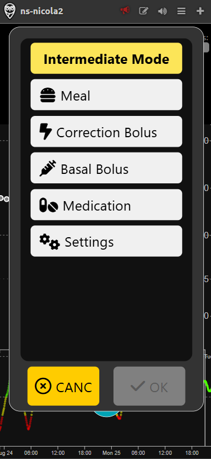
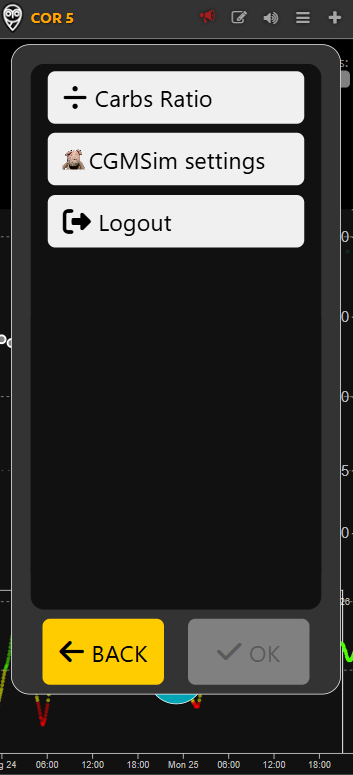
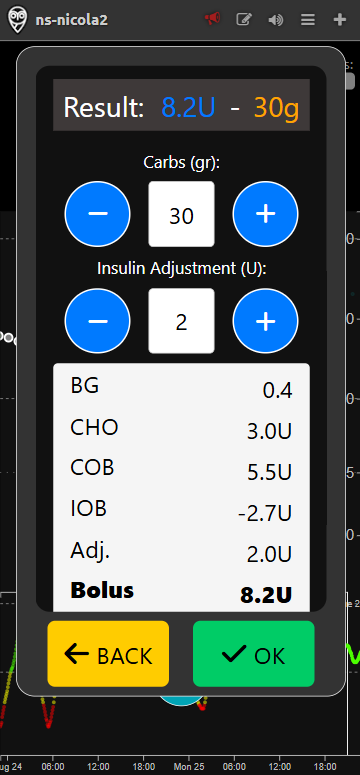
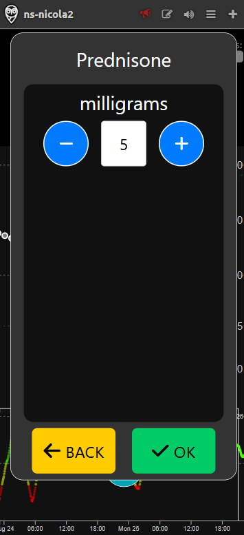
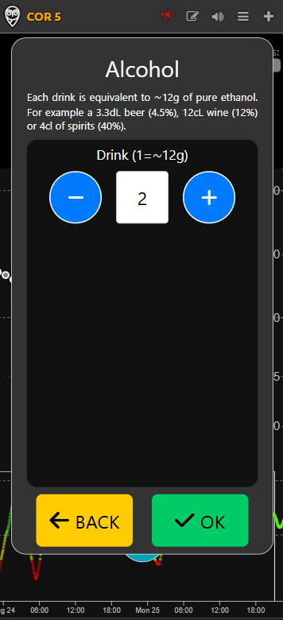

# Intermediate mode

Intermediate mode simulates therapy with **multiple daily injections** and builds upon the foundation of [**Beginner**](beginner.md) mode. It keeps the simplicity of manual carbohydrate and insulin entry, while introducing several advanced features. In this mode, users can set a personal insulin-to-carbohydrate ratio (CR) for automatic bolus calculation, making meal and therapy management more precise, flexible, and tailored to individual needs. Additionally, users can log cortisone administration—which is important for tracking medications that may impact blood glucose—and record alcohol intake, allowing for better monitoring of factors that can influence glycemic control during daily life or social occasions.

## Insulin-to-Carbohydrate Ratio

With Intermediate mode, users can set their own insulin-to-carbohydrate ratio, which is a key parameter for calculating meal boluses. By entering this ratio, the app can suggest the appropriate amount of insulin to administer with each meal, streamlining the process and reducing the risk of miscalculations.

## Meal Bolus Calculation

When logging a meal, the app leverages the defined insulin-to-carbohydrate ratio to recommend a bolus dose. This feature simplifies the decision-making process for users, ensuring that insulin dosing is both accurate and consistent with their personal therapy plan.

## Cortisone Administration

Intermediate mode also supports the recording of cortisone administration. Since cortisone can significantly impact blood glucose levels, this feature helps users and healthcare providers monitor and adjust insulin therapy accordingly, promoting safer and more effective diabetes management.

## Alcoholic Drinks Management

In addition to the above, Intermediate mode allows users to define and log alcoholic drinks. This functionality is particularly useful for tracking the effects of alcohol on blood glucose and insulin requirements, supporting safer choices during social occasions and better overall control.

All features available in [**Beginner**](beginner.md) mode, such as correction bolus and basal insulin logging, remain accessible in Intermediate mode, ensuring a comprehensive and adaptable experience for users as their needs evolve.
