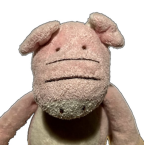

## Meet the team

Lorenzo Sandini
<a href="https://github.com/lsandini" target="blank">View on Github :octicons-mark-github-16:{ .github }</a>

"Lorem ipsum dolor sit amet, consectetur adipiscing elit, sed do eiusmod tempor incididunt ut labore et dolore magna aliqua. Ut enim ad minim veniam, quis nostrud exercitation ullamco laboris nisi ut aliquip ex ea commodo consequat. Duis aute irure dolor in reprehenderit in voluptate velit esse cillum dolore eu fugiat nulla pariatur. Excepteur sint occaecat cupidatat non proident, sunt in culpa qui officia deserunt mollit anim id est laborum."

I am an endocrinologist/diabetologist, with an interest for things that tick and beep.

Nicola Febbrari
<a href="https://github.com/nickxbs" target="blank">View on Github :octicons-mark-github-16:{ .github }</a>

"Lorem ipsum dolor sit amet, consectetur adipiscing elit, sed do eiusmod tempor incididunt ut labore et dolore magna aliqua. Ut enim ad minim veniam, quis nostrud exercitation ullamco laboris nisi ut aliquip ex ea commodo consequat. Duis aute irure dolor in reprehenderit in voluptate velit esse cillum dolore eu fugiat nulla pariatur. Excepteur sint occaecat cupidatat non proident, sunt in culpa qui officia deserunt mollit anim id est laborum."

I am an IT engineer with an interest for medicine :fontawesome-regular-face-laugh-wink:

## Contact us ! 

There are quite a few good reasons to contact us:

!!! warning "Development ideas"
    The physical activity model is very empiric and needs improvements and validation

    Add the effect of glucocorticoids

    Suggest new features, report bugs :wink:

    Planning a study of the impact of CGMSIM as a teaching tool ?   

  
The source code of the cgmsim-lib must be released !

Found a bug in the [source code of the lib](https://github.com/lsandini/cgmsim) ? 

## Donate

!!! danger "Coffee ... :coffee:"
    This project was not funded in any way and was written completely during our free time. It required quite some coffee, working late at night. 
    
    During the initial testing phase, there were substantial costs for hosting the main website, and numerous Nightscout instances. We reduced these costs to the minimum, but some developer licences are required for producing and distributing the mobile app, registering the domain names, etc...

<form action="https://www.paypal.com/donate" method="post" target="_top">
<input type="hidden" name="business" value="XHKH4ATJDS5AG" />
<input type="hidden" name="no_recurring" value="1" />
<input type="hidden" name="item_name" value="Type 1 Diabetes Simulator" />
<input type="hidden" name="currency_code" value="EUR" />
<input type="image" src="https://www.paypalobjects.com/en_US/i/btn/btn_donate_SM.gif" border="0" name="submit" title="PayPal - The safer, easier way to pay online!" alt="Donate with PayPal button" />

</form>

Click the Paypal "Donate" button above to support my work, if you feel it was worth the effort. All donations will be used **strictly for maintaining this project** (and occasional coffee). 

Alternatively consider making a donation to [Tidepool](https://tidepool.salsalabs.org/tidepool-donate/index.html), the [Nightscout Foundation](https://www.nightscoutfoundation.org/donate), the [JDRF](https://www2.jdrf.org/site/Donation2?2376.donation=form1&df_id=2376&s_src=jdrf.org&s_subsrc=siteMenuButton) or any charitable organisation of your choice !

  