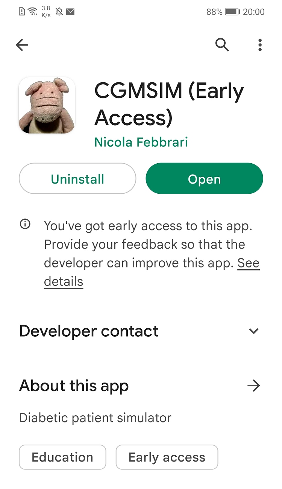

# Access the App

You can install and use the mobile app by visiting the Play Store or iOS Store.

Click on the images below to open the app:

> Replace `YOUR_APP_ID` with the actual app id or link for your app in the stores. For iOS, use the appropriate App Store link.
