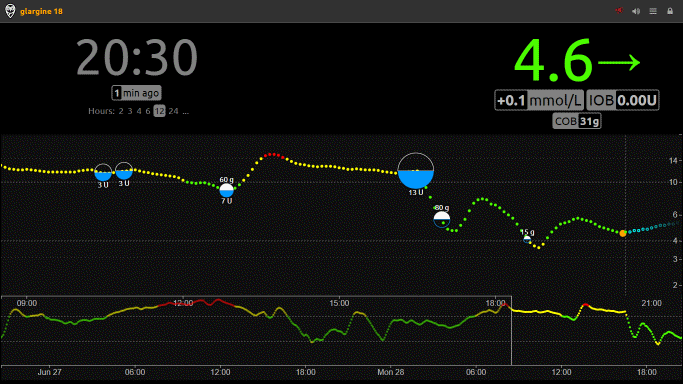

---
hide:
  - navigation
---

# Welcome to the CGMSIM v3.0 documentation

CGMSIM is an interactive real time simulation. It is designed for people without diabetes to experience the effects of different meals, physical activities, and insulin treatments on blood sugar levels in **Type I or juvenile diabetes (T1D)**.

CGMSIM **simulates** a continuous glucose monitoring (CGM) system depicting changes in blood glucose levels over time. It allows its users to better understand how the timing of their meals and treatment choices can affect diabetes management results.

Each simulated CGMSIM patient is coupled to a <a href="https://nightscout.github.io/" target="_blank"> Nightscout </a> website, used to display the CGM curve and to declare meals and insulin doses. CGMSIM provides a new, personal Nightscout instance if needed.

<u>Manage your virtual patient in a browser with your handeld device, CGMSIM runs in the cloud !</u>

 &nbsp;&nbsp;  &nbsp;&nbsp;  

## New features :

1. CGMSIM v.3 is a completely rewritten web application, **no longer requiring any installation**. You can either create an account, or log in using your Google or Fitbit credentials: <b><a href="https://cgmsim.com/auth" target="_blank"> https://cgmsim.com </a></b>

2. If you are using a physical activity tracker, **CGMSIM can access your activity data** (such as steps and heart rate) from the <a href="https://www.fitbit.com/" target="_blank"> Fitbit </a> or <a href="https://www.google.com/fit/" target="_blank"> Google Fit</a> APIs and incorporate them into the simulation to calculate their impact on your simulated patient.

3. CGMSIM can simulate both **Multiple Daily Injections (MDI) and Continuous Subcutaneous Insulin Infusion (CSII or insulin pump)** treatment regimens. Additionally, users can couple the simulated T1D patient with various DIY artificial pancreas software solutions such as (<a href="https://loopkit.github.io/loopdocs/" target="_blank">iOS Loop</a>, <a href="https://androidaps.readthedocs.io/en/latest/" target="_blank"> AndroidAPS</a>, or <a href="https://openaps.org/" target="_blank"> openAPS</a>).

4. The developers of the <a href="https://lt1.org/" target="_blank"> LoopInsightT1 simulator</a> have reworked the **UVA/Padova simulation** mathematics, and we have incorporated this model into CGMSIM.

5. CGMSIM offers optional **email alerts** for high and low blood glucose levels. Moreover, immediate **push notifications**  are available for mobile devices, using a separate iOS or Android application.
 

## Introduction

Since even the most accurate physiological simulators can at best provide only an approximation of what happens in a living organism, the goal of this simulation is not even to try to match reality, but to provide a framework for practising, learning and/or teaching.

The treatment goal in type 1 diabetes is to keep the BG or CGM curve values as close as possible to that of a healthy person. In realistic terms, it means 3.9 – 10 mmol/l or 70-180 mg/dl for CGM curves. The Time In Range (TIR) should be at least 70%.

!!! warning "Important"
    Please understand that this simulation:

    - cannot predict individual response to treatment
    - cannot replace traditional patient/caregiver education
    - does not depict 100% realistically human physiology

    **This is work in progress, and all feedback is welcome !**

## Human physiology

To understand the mechanics of the simulation, a few things must be considered.

1. After a meal, the **absorption of carbohydrates** from the gut will increase your blood glucose (BG). Since insulin replacement is administered subcutaneously and not directly into the hepatic portal vein, the liver is inable to "filter" glucose and some of the ingested carbs will be absorbed into the main bloodstream directly, bypassing the liver. After a short delay, the CGM will reflect the increase of blood glucose.

2. The **endogenous glucose production** (EGP) is mainly due to the liver release of glucose into the bloodstream, either by releasing stores (glycogenolysis) or by synthesizing new glucose (neoglucogenesis). Various biological states, medications, alcohol and hormones can affect EGP. As glucose is released into the bloodstream, BG increases.

3. **Physical exercise** affects blood glucose in many ways. Short bouts of intense physical activity will trigger the release of adrenaline (epinephrine), which increases the EGP. In turn, the increased peripheral uptake of glucose in the muscle tissue will lower the blood glucose as physical activity continues. The same continues also during the post-exercise phase, until the muscle glycogen stores are repleted.

4. **Mealtime insulins** have a short duration of activity (DIA, ~3 hours), while **long-acting insulin analogs** are meant to be injected once or twice a day. Both will lower blood glucose and thus CGM values.

5. The intricate biological pathways affecting the blood glucose variations are difficult to replicate mathematically. The absorption of ingested food from the gut, the absorption of insulin from the subcutaneous tissue, the timing of exercise, the circadian rhythm, menstrual cycle, the moon phase and the alignment of planets and stars :wink: all seem to play a role. Adding a touch of **random variation** (or chaos) brings some realism into the simulation.  

## Why use a simulator ?

Many **scenario-based** simulators have been written in the past, like [AIDA](http://www.2aida.org/) or the [UVA/Padova T1DMS](https://www.ncbi.nlm.nih.gov/pmc/articles/PMC4454102/). In contrast, CGMSIM runs in **real time** like a "serious game" or a "tamagotchi". It requires time and dedication to reach its goal. It is not a matter of hours or days, but rather weeks or months. 

!!! danger "Healthcare Professionals - HCPs"
    Unless you or your family member has T1D, it is hard to figure how treatment can be time-consuming, technically difficult or frustrating. Even without having to worry about the risk of long-term vascular complications or acute life-threatening hypoglycemia, early adopters of this simulator showed signs of treatment fatigue after a few weeks already.

    Living with incertainty 24/7, and facing reports of treatment "success" will teach some humility and empathy.

!!! info "Not all patients are equal..."
    Every simulated patient can be defined in terms of weight, height, gender, age, insulin sensitivity, amplitude of EGP variability and carb ratio.

This website will describe step by step how create your virtual subject's profile, and how to use the simulator.

## Where is the source code ?

**The source code of the original CGMSIM project and more technical details on how various scripts are excecuted and interact with each other can be found in the [CGMSIM project's repository](https://github.com/lsandini/cgmsim). This version is now deprecated in favour of the new, multiuser version**.

**Since the major code rewrite and update to CGMSIM v.3, the repository is private until further notice. We plan to release the library of functions if we notice a general interest of the project, or receive requests for the original code.**

<!-- Global site tag (gtag.js) - Google Analytics -->

