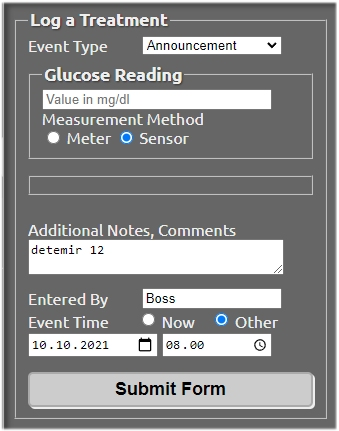
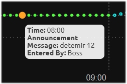

# Long acting insulin agonists

As there is no dedicated feature in Nightscout for declaring long-acting insulin injections, you will have to do it as an "Announcement" in Careportal.
 

## Announcements

When logging the injection in Careportal, select "Announcement" in the drop-down list. Again, check "Sensor", under Glucose Reading, so that the entry will be superimposed with the SGV curve. 

**The syntax for the entry is important, as CGMSIM is not very error-tolerant. The most important are the 3 first letters and a blank space before the dose (in numbers). The first letter can either be upper, or lower case**

!!! warning "Mind the spelling and syntax !"
    In the "notes" field, please write down the selected insulin first, and then the number of units, separated by a **single empty space**:

    Valid entries are for example:  

        - detemir 12  
        - Detemir 14 U  
        - levemir 10
        - glargine 22  
        - Glargine 18 Units
        - Lantus 17 u
        - Toujeo 16 U
        - touj 14
        - degludec 15
        - Tresiba 17 U  
  
    These entries are NOT valid :

        - detemir12  (missing blank space)
        - 12U glargine (indicate insulin first, then dose)
        - Livemir 20U (spelling error in the first 3 letters)
        - TRESIBA 18 u (all capital letters not allowed)
 

## Example

 
The announced injection will appear as an orange dot on the SGV curve:

next, let's make sure physical activity data get downloaded for the cloud and uploaded to Nightscout. [Check for activity data.](activity.md)