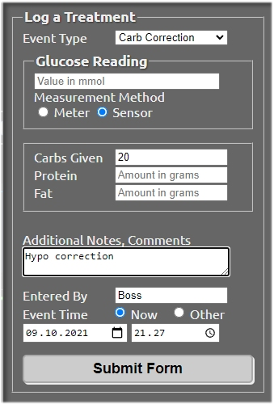
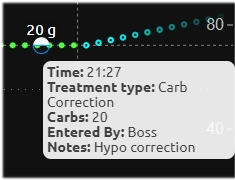
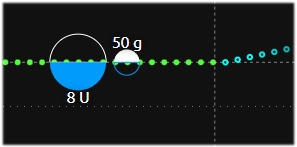

# Declaring meals and mealtime insulins

## Declaring food alone

Open Careportal by pressing the **"+"** sign on the upper right corner of Nightscout.

You are presented with the option to "Log a Treatment". Next to "Event Type", a drop-down menu lists all items you can choose from. Let's assume you want to enter some carbs due to a low glucose value. 

1. Select "Carb Correction"
2. Under Glucose Reading, leave the filed blank, and instead tick the "Sensor" box.
3. Next to Carbs Given, enter 20
4. Protein and Fat are unaccounted for, so leave them blank
5. Add Notes (optional)
6. Entered By : enter your initials, or anything identifying you as the author of the entry
7. Select the correct time for the entry
8. Submit the form. You will be prompted to review the details and accept.

Now you should see the meal appear on the Nightscout curve. Placing your cursor on top of the meal marker, the details should appear.

 
 

## Declaring food and insulin

To declare mealtime insulin at the same time as carbs, the Event Type should be either "Snack Bolus" or "Meal Bolus". (Combo Bolus is not supported !).

You will have to specify the "Carb Time", which is the time of the meal in relation to the insulin injection. So if you inject first, and eat 20 minutes later, Carb Time should be "20 min later". When submitting the entry, the time is the time of the insulin injection. 

Let's move on to [declaring long acting insulin agonist injections (detemir and glargine).](la-agonists.md)
