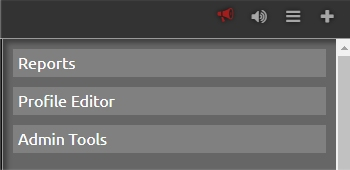
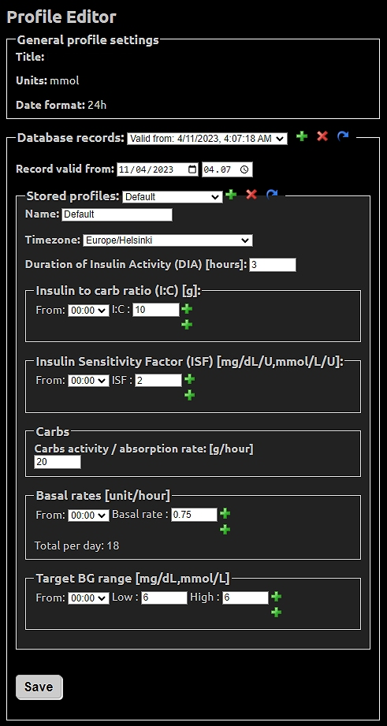

# Accessing the Profile editor

After the "standard" deployment of a Nightscout website, you are prompted to enter a "Default Profile" before the website is ready to be used. 

When "spawning" or deploying Nightscout with CGMSIM, we take care of this step for you. You can access the profile editor again by clicking the central icon (or "hamburger") on the upper right corner of Nightscout.

The Profile editor allows you to create or modify a basal insulin infusion profile, to simulate an insulin pump.

In the opening menu, select "Profile Editor":

In the Editor, you will have to specify some variables, that CGMSIM will pick up for its calculations.

1. If you are creating a brand new profile, select the blue arrow on the line "Database records"
2. Save the current record before switching to the new profile
3. Be sure to select the correct Timezone

4. The Duration of Insulin Activity (DIA), insulin to Carb ratio (I:C) and Insulin Sensitivity Factor are irrelevant here, since the simulated subject's paramters are set in CGMSIM's Admin Panel, not in Nightscout. Nevertheless, enter realistic values in the fields. 

5. Enter the basal rates, making consecutives periods if needed

6. Be sure to save the profile before closing the Profile Editor window

Let's move on to [declaring meals and mealtime insulins.](meals.md)
